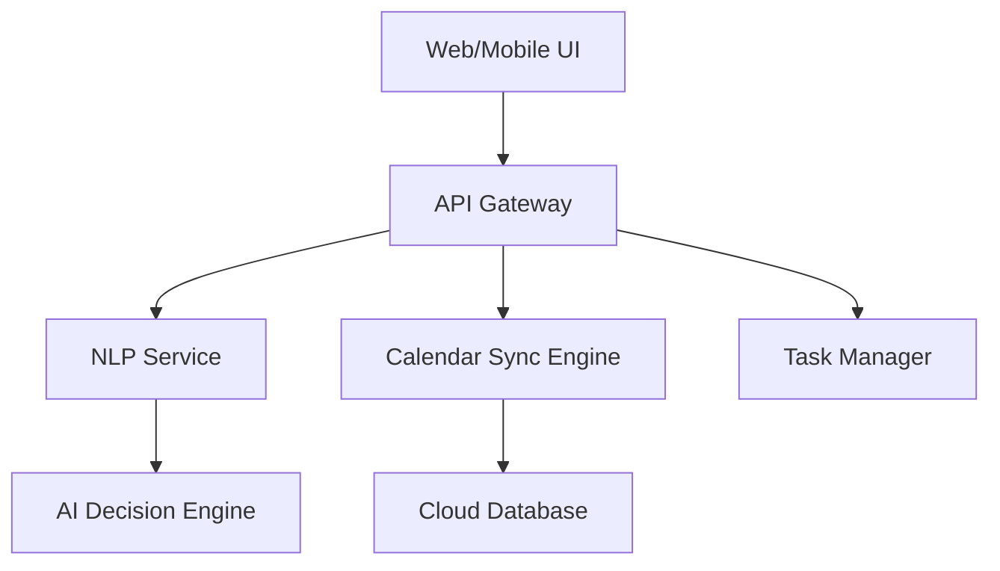

# Calendar Agent Product Requirements Document

## Executive Summary
A smart AI-driven personal assistant unifying Google Calendar, Outlook, and iCal with natural language processing and proactive scheduling capabilities. Combines multi-calendar management, task integration, and agentic behavior to optimize personal productivity.

## User Personas & Use Cases
### Target Users:
- Executives managing complex meeting schedules
- Remote workers coordinating across timezones
- Entrepreneurs juggling multiple commitments

### Key Use Cases:
1. Cross-calendar conflict resolution
2. Voice/text-based schedule queries
3. Automated task prioritization
4. Intelligent meeting rescheduling

## Technical Specifications
### Core Integrations:
- Google Calendar API
- Microsoft Graph API
- Apple Calendar (CalDAV)
- GPT-4 for NLP processing

### Architecture Components:

## Security Architecture
- OAuth 2.0 authentication flow
- AES-256 encryption at rest
- VPC-isolated microservices
- GDPR-compliant data handling
