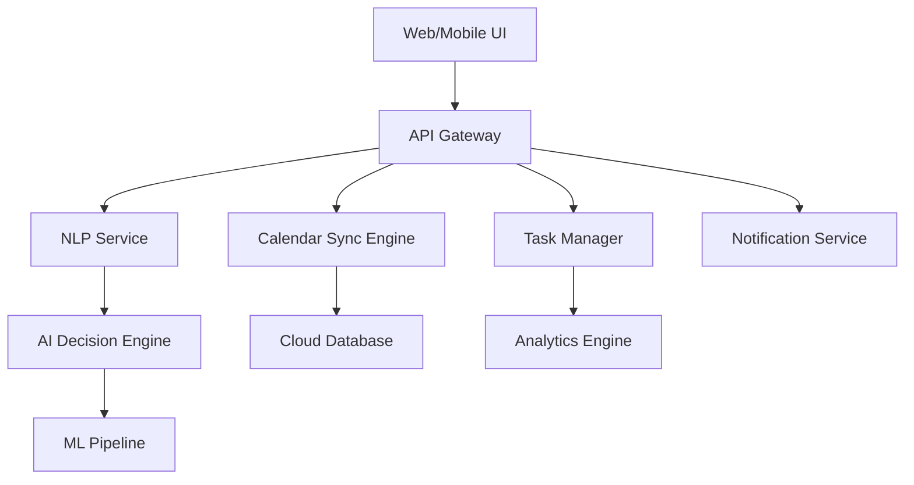

# Calendar Agent Product Requirements Document

## Executive Summary
A smart AI-driven personal assistant unifying Google Calendar, Outlook, and iCal with natural language processing and proactive scheduling capabilities. Combines multi-calendar management, task integration, and agentic behavior to optimize personal productivity.

## User Personas & Use Cases

### Target Users:
- **Executives & Business Leaders**
  - Complex meeting schedules across multiple organizations
  - High-stakes scheduling decisions
  - Need for seamless delegation and assistant integration
- **Remote Workers & Digital Nomads**
  - Cross-timezone coordination challenges
  - Flexible work hours requiring smart scheduling
  - Multiple team calendars to manage
- **Entrepreneurs & Freelancers**
  - Dynamic scheduling needs
  - Client meeting management
  - Project deadline coordination
- **Team Managers**
  - Resource allocation and availability tracking
  - Team capacity planning
  - Meeting efficiency optimization

### Key Use Cases:
1. **Cross-calendar Conflict Resolution**
   - Automatic detection of scheduling conflicts
   - Smart rescheduling suggestions
   - Priority-based conflict resolution
   - Multi-timezone optimization

2. **Natural Language Interaction**
   - Voice-based schedule queries and updates
   - Context-aware scheduling commands
   - Conversational rescheduling
   - Meeting intent understanding

3. **Automated Task Prioritization**
   - AI-driven importance scoring
   - Deadline-aware scheduling
   - Energy level optimization
   - Focus time protection

4. **Intelligent Meeting Management**
   - Smart duration suggestions
   - Participant availability optimization
   - Location/platform recommendations
   - Pre-meeting preparation reminders

5. **Calendar Analytics & Insights**
   - Time allocation analysis
   - Productivity patterns
   - Meeting effectiveness metrics
   - Work-life balance tracking

## Technical Specifications

### Core Integrations:
1. **Calendar Platforms**
   - Google Calendar API (v3)
   - Microsoft Graph API (v1.0)
   - Apple Calendar (CalDAV)
   - Custom calendar adapters

2. **AI/ML Components**
   - GPT-4 for NLP processing
   - Custom ML models for scheduling optimization
   - Recommendation engine
   - Pattern recognition system

3. **Communication Platforms**
   - Email integration (SMTP/IMAP)
   - Slack/Teams webhooks
   - SMS gateway
   - Push notifications

### Architecture Components:

### Data Model:
1. **Event Schema**
   - Core metadata
   - Participant information
   - Context and relationships
   - Historical patterns

2. **User Preferences**
   - Scheduling preferences
   - Time zone settings
   - Privacy controls
   - Integration settings

3. **AI Training Data**
   - Scheduling patterns
   - User feedback
   - Success metrics
   - Behavioral data

## Security Architecture

### Authentication & Authorization
- OAuth 2.0 authentication flow
- Role-based access control (RBAC)
- Multi-factor authentication
- Session management

### Data Protection
- AES-256 encryption at rest
- TLS 1.3 for data in transit
- Key rotation policies
- Secure credential storage

### Infrastructure Security
- VPC-isolated microservices
- WAF and DDoS protection
- Regular security audits
- Automated vulnerability scanning

### Compliance
- GDPR-compliant data handling
- CCPA compliance
- SOC 2 Type II controls
- Privacy by design principles

## Performance Requirements

### Scalability Targets
- Support for 100k+ concurrent users
- Sub-second response times
- 99.9% uptime SLA
- Global CDN distribution

### Resource Optimization
- Efficient caching strategy
- Background task processing
- Smart data pagination
- Resource pooling

## Monitoring & Analytics

### System Monitoring
- Real-time performance metrics
- Error tracking and alerting
- Resource utilization
- API usage analytics

### User Analytics
- Engagement metrics
- Feature adoption
- User satisfaction
- Churn prediction

## Future Extensibility

### Integration Framework
- Plugin architecture
- Custom calendar adapters
- Webhook system
- API versioning strategy

### AI/ML Pipeline
- Model retraining system
- Feature extraction pipeline
- A/B testing framework
- Feedback loop integration
